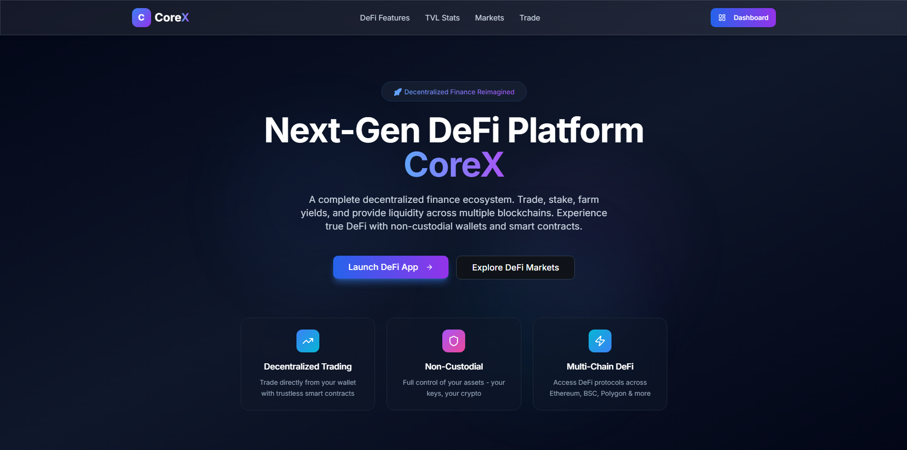

# CoreX - Next-Generation DeFi & Crypto Trading Platform

CoreX is a complete decentralized finance (DeFi) and cryptocurrency trading ecosystem built with React, TypeScript, and Node.js. Experience the power of DeFi with yield farming, staking, liquidity pools, and DEX trading, combined with professional spot trading tools, non-custodial wallet management, and real-time multi-chain market data.



## 🚀 Quick Start

Get started in 3 simple steps:

```bash
# 1. Clone the repository
git clone https://github.com/technical-org/corex-arc.git
cd corex-arc

# 2. Install dependencies
npm install

# 3. Run the application (frontend + backend)
npm run dev
```

That's it! 
- **Frontend**: http://localhost:8080
- **Backend API**: http://localhost:3000
